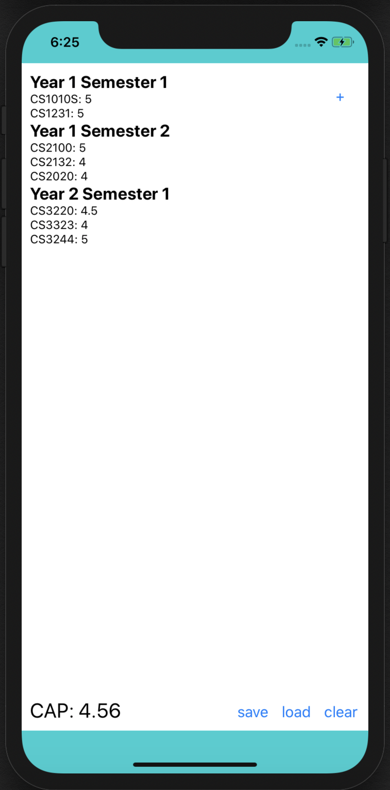

# CAPcalculator
This is a primitive CAP calculator that allows you to input your modules and grade, calculate your CAP and store the data.

 

## How to use
Currently the app can only be used on an iPhone simulator. Plans to upload it onto AppStore. 

Use the command `npx react-native run-ios` in terminal to run the app on xcode simulator. 

To add, click the `+` at the top right of the app.

- Semester is the number of semester when the module is taken 
- Grade is the number of points allocated to the grade received

Then press add.

To edit a module, only the module code and grade is required.

To delete a module, only the module code is required.

## Future Updates
1. Uploading the app onto AppStore
2. Allow the input of grades as letters.

